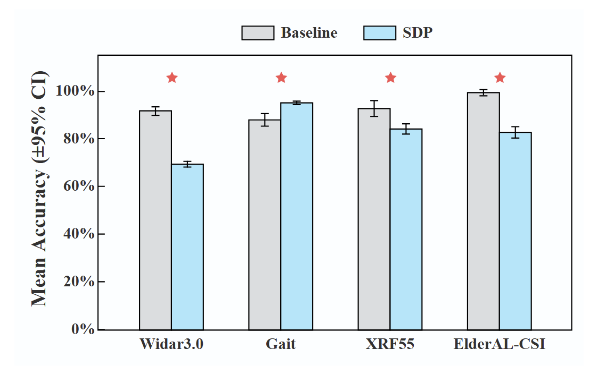
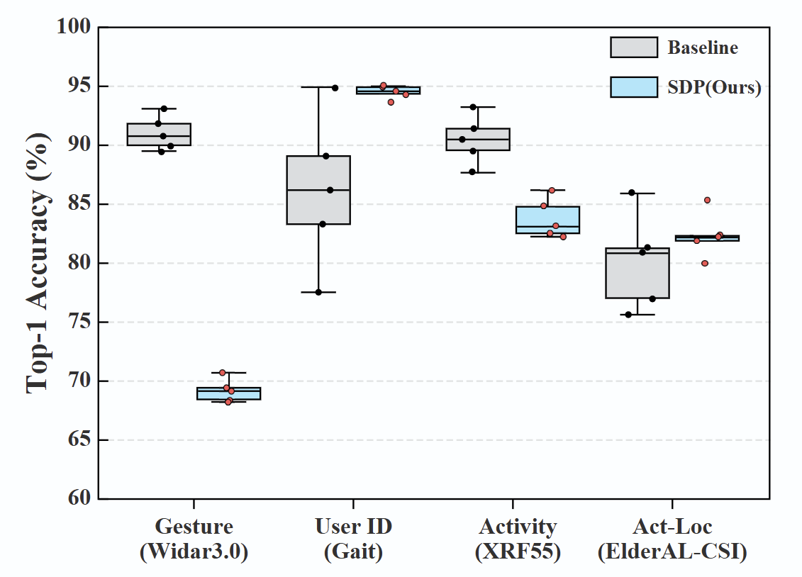
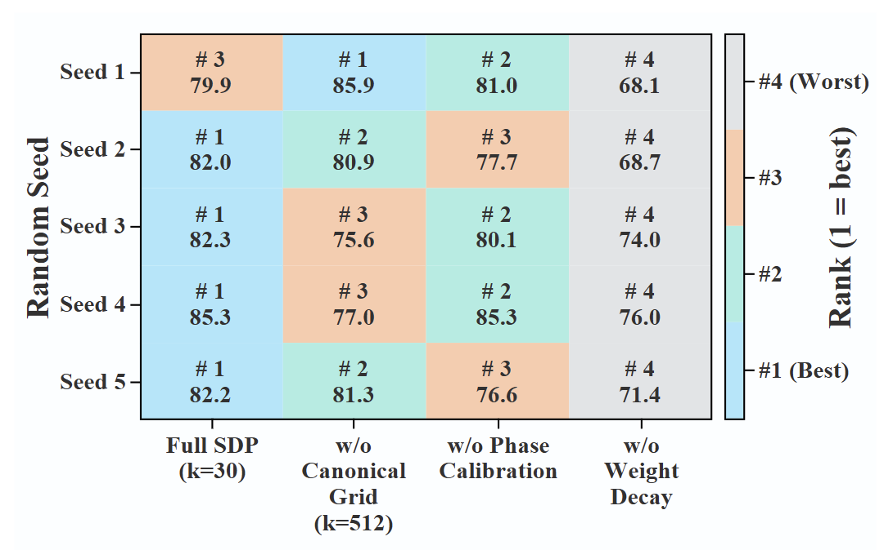

# SDP: Sensing Data Protocol for Scalable Wireless Sensing

<div align="center">

[](https://sdp8.org/)
[](https://pypi.org/project/wsdp/)
[](https://github.com/yuanhao-cui/Sensing-Data-Protocol/blob/main/LICENSE)
[](https://python.org)
[](https://pytorch.org)
[](https://docs.pytest.org)
[](https://yuanhao-cui.github.io/SDP-Sensing-Data-Protocol-for-Scalable-Wireless-Sensing/)
[](https://colab.research.google.com/github/sdp-team/wsdp/blob/main/examples/wsdp_tutorial.ipynb)

**Published and maintained by [SDP8.org](https://sdp8.org) — the official platform for reproducible wireless sensing.**

</div>

---

## 📖 Citation

If you use SDP in your research, please cite:

```bibtex
@misc{zhang2026sdpunifiedprotocolbenchmarking,
      title={SDP: A Unified Protocol and Benchmarking Framework for Reproducible Wireless Sensing}, 
      author={Di Zhang and Jiawei Huang and Yuanhao Cui and Xiaowen Cao and Tony Xiao Han and Xiaojun Jing and Christos Masouros},
      year={2026},
      eprint={2601.08463},
      archivePrefix={arXiv},
      primaryClass={eess.SP},
      url={https://arxiv.org/abs/2601.08463}, 
}
```

---

<div align="center">

**[🇬🇧 English](#english) | [🇨🇳 中文](#中文)**

</div>

---

<a id="english"></a>
# 🇬🇧 English

## 🎯 What is SDP?

SDP is a **protocol-level abstraction** and unified benchmark for **reproducible wireless sensing**.

> ⚠️ **SDP is not a new neural network**, but a standardized protocol that unifies CSI representations for fair comparison.

### The Problem

Wireless sensing research often suffers from:
- ❌ Hardware-specific CSI formats
- ❌ Inconsistent preprocessing pipelines  
- ❌ Unstable training results
- ❌ Large performance variance across random seeds

**Result**: Models cannot be fairly compared.

### The Solution

SDP solves this at the **protocol level**, not the model level:

| Feature | Raw CSI | Other Tools | **SDP** |
|:-------:|:-------:|:-----------:|:-------:|
| **Standardized Format** | ❌ Hardware-specific | ⚠️ Partial | ✅ **Unified CSIFrame** |
| **Multi-Dataset Support** | ❌ Manual parsing | ⚠️ 2-3 datasets | ✅ **5 datasets built-in** |
| **Preprocessing** | ❌ DIY | ⚠️ Basic only | ✅ **Wavelet + Phase Calib** |
| **Reproducibility** | ❌ Random | ⚠️ Varies | ✅ **5-seed standard** |
| **Deep Learning** | ❌ From scratch | ⚠️ Limited | ✅ **CNN+Transformer** |
| **CLI Interface** | ❌ None | ⚠️ Partial | ✅ **Full CLI support** |

SDP projects raw CSI into a fixed **canonical frequency grid (K=30)**, ensuring cross-hardware comparability.

### Performance Highlights

<div align="center">

| Metric | Result |
|:------:|:------:|
| **Accuracy** | SOTA on 5 datasets |
| **Reproducibility** | 5-seed evaluation standard |
| **Stability** | Low variance across runs |


*Figure 1: Accuracy comparison across datasets*


*Figure 2: Reproducibility and stability analysis*


*Figure 3: Ablation study results*

</div>

---

## 🚀 Quick Start (3 Steps, 5 Minutes)

### Step 1: Install (30 seconds)

```bash
pip install wsdp
```

Verify installation:
```bash
wsdp --version
```

### Step 2: Download Dataset (2 minutes)

> 🔑 **Required**: Create a free account at **[SDP8.org](https://sdp8.org)** — your account credentials are needed for dataset downloads.

**Option A: From CLI (Recommended for testing)**

All datasets hosted on **[SDP8.org](https://sdp8.org)**:

```bash
# elderAL = smallest dataset, fastest for testing
# Use your SDP8.org email/password:
wsdp download elderAL ./data --email you@example.com --password yourpassword

# Or use a JWT token (from SDP8.org dashboard):
wsdp download elderAL ./data --token YOUR_JWT_TOKEN

# Download larger datasets:
# wsdp download widar ./data --email you@example.com --password yourpassword
# wsdp download gait ./data --email you@example.com --password yourpassword
# wsdp download xrf55 ./data --email you@example.com --password yourpassword
# wsdp download zte ./data --email you@example.com --password yourpassword
```

**Option B: From [SDP8.org](https://sdp8.org) Web Interface**

Log in at [sdp8.org](https://sdp8.org) and download datasets manually.

**Required Dataset Structure:**
```
data/
├── elderAL/                    # Dataset name
│   ├── action0_static_new/     # Activity folder
│   │   ├── user0_position1_activity0/  # Sample folder
│   │   │   ├── sample1.csv
│   │   │   └── ...
│   │   └── ...
│   ├── action1_walk_new/
│   └── ...
├── widar/
├── gait/
├── xrf55/
└── zte/
```

### Step 3: Train & Evaluate (2 minutes)

**🐍 Python API (Recommended for research):**

Create `train.py`:
```python
from wsdp import pipeline

# Minimal call - uses default hyperparameters
pipeline("./data/elderAL", "./output", "elderAL")

# Or with custom hyperparameters
pipeline(
    input_path="./data/elderAL",
    output_folder="./output",
    dataset="elderAL",
    learning_rate=1e-3,
    num_epochs=50,
    batch_size=64,
)
```

Run:
```bash
python train.py
```

**💻 CLI (Quick & Simple):**

```bash
# Basic training
wsdp run ./data/elderAL ./output elderAL

# With hyperparameter override
wsdp run ./data/elderAL ./output elderAL --lr 0.001 --epochs 50 --batch-size 64

# With config file
wsdp run ./data/elderAL ./output elderAL --config my_config.yaml
```

**📊 What You Get:**

After training, check `./output/`:
```
output/
├── best_model.pth              # Best model checkpoint
├── confusion_matrix.png        # Evaluation visualization
├── training_curves.png         # Loss & accuracy curves
└── output.log                  # Detailed training logs
```

✅ **If you see these files, SDP is working correctly!**

---

## 📊 Supported Datasets

| Dataset | Format | Subcarriers | Complex | Scenarios | Size |
|:-------:|:------:|:-----------:|:-------:|:---------:|:----:|
| **Widar** | .dat (bfee) | 30 | ✅ | Gesture recognition | ~2GB |
| **Gait** | .dat (bfee) | 30 | ✅ | Gait recognition | ~1GB |
| **XRF55** | .npy | 30 | ✅ | Human activity | ~3GB |
| **ElderAL** | .csv | varies | ❌ | Elderly activity | ~500MB |
| **ZTE** | .csv | 512 | ✅ | CSI with I/Q | ~4GB |

**More datasets coming soon!** See [Roadmap](#roadmap).

---

## 🔬 Research & Customization

### 🧠 Plug in Your Own Model

**Step 1:** Create `custom_model.py`:
```python
import torch
import torch.nn as nn

class YourCustomModel(nn.Module):
    def __init__(self, num_classes=6):
        super().__init__()
        # Your architecture here
        # Input shape: (Batch, Timestamp, Frequency, Antenna)
        
    def forward(self, x):
        # Your forward pass
        return output

# Required: expose model class
model = YourCustomModel
```

**Step 2:** Run with your model:
```bash
wsdp run ./data/elderAL ./output elderAL -m custom_model.py
```

### 📁 Use Your Own Dataset

**Organize your data:**
```
data/
└── my_dataset/
    ├── user0_pos0_action0/
    │   ├── sample1.csv
    │   └── ...
    └── user0_pos0_action1/
        └── ...
```

**Run:**
```bash
wsdp run ./data/my_dataset ./output my_dataset
```

### 🗺️ Codebase Map

Want to go deeper? Here's where to modify:

| Directory | Purpose | What to Modify |
|:---------:|:-------:|:--------------:|
| `models/` | Architectures | Define or compare model architectures |
| `algorithms/` | Signal Processing | Denoising, calibration, etc. |
| `datasets/` | Dataset Wrappers | Add new dataset loaders |
| `readers/` | File Readers | Add new format parsers |
| `structure/` | Data Structures | Modify CSIFrame format |
| `processors/` | Protocol Logic | Adjust canonical projection |

---

## 🧪 Understanding SDP (10-Min Deep Dive)

### The SDP Pipeline

```
Raw CSI
  ↓
[Deterministic Sanitization]
  - Phase calibration
  - Wavelet denoising
  ↓
[Canonical Tensor Construction]
  - K=30 frequency grid
  - Standardized shape
  ↓
[Deep Learning Model]
  ↓
Prediction
```

### Canonical Tensor Format

After sanitization, SDP constructs a **Canonical CSI Tensor**:

$$X \in \mathbb{C}^{A \times K \times T}$$

Where:
- $A$ = Number of antennas
- $K$ = 30 (fixed frequency grid)
- $T$ = Time samples

This ensures **cross-hardware comparability**.

### Why Deterministic?

Raw CSI contains hardware distortions:
- Phase offsets
- Sampling time offsets  
- Noise fluctuations

SDP enforces **deterministic calibration and denoising**, guaranteeing:
- ✅ Same raw CSI → Same cleaned tensor
- ✅ Reproducibility is enforced, not optional

---

## 📚 Documentation & Resources

- 📖 [Full Documentation](https://sdp-team.github.io/wsdp)
- 🔧 [API Reference](docs/API_REFERENCE.md)
- 🤝 [Contributing Guide](CONTRIBUTING.md)
- 📝 [Changelog](CHANGELOG.md)
- 💻 [Colab Tutorial](https://colab.research.google.com/github/sdp-team/wsdp/blob/main/examples/wsdp_tutorial.ipynb)

---

## 🗺️ Roadmap

- [x] **v0.1** - Initial protocol design
- [x] **v0.2** - 5 datasets support, CLI tool
- [ ] **v0.3** - More datasets (WiFi-HAR, CSI-HAR, etc.)
- [ ] **v0.4** - Online demo platform
- [ ] **v0.5** - PyPI official release
- [ ] **v1.0** - Full protocol standardization

**Want a specific dataset?** [Open an issue](https://github.com/yuanhao-cui/Sensing-Data-Protocol-for-Scalable-Wireless-Sensing/issues) and let us know!

---

## 🤝 Contributing

We welcome contributions! See [CONTRIBUTING.md](CONTRIBUTING.md) for:
- Development setup
- Coding guidelines
- Pull request process

---

## 📄 License

MIT License - see [LICENSE](LICENSE) file.

---

<a id="中文"></a>
# 🇨🇳 中文

## 🎯 SDP 是什么？

SDP 是一个**协议级抽象**框架，用于**可复现的无线感知研究**。

> ⚠️ **SDP 不是一个新的神经网络**，而是一个标准化协议，统一 CSI 表示以实现公平比较。

### 问题所在

无线感知研究常面临：
- ❌ 硬件特定的 CSI 格式
- ❌ 不一致的预处理流程
- ❌ 不稳定的训练结果
- ❌ 随机种子间性能方差大

**结果**：模型无法公平比较。

### 解决方案

SDP 在**协议层面**解决问题，而非模型层面：

| 特性 | 原始 CSI | 其他工具 | **SDP** |
|:----:|:--------:|:--------:|:-------:|
| **标准化格式** | ❌ 硬件特定 | ⚠️ 部分支持 | ✅ **统一 CSIFrame** |
| **多数据集支持** | ❌ 手动解析 | ⚠️ 2-3 个 | ✅ **5 个内置数据集** |
| **预处理** | ❌ 自行实现 | ⚠️ 仅基础 | ✅ **小波+相位校准** |
| **可复现性** | ❌ 随机 | ⚠️ 不稳定 | ✅ **5 种子标准** |
| **深度学习** | ❌ 从零开始 | ⚠️ 有限 | ✅ **CNN+Transformer** |
| **CLI 接口** | ❌ 无 | ⚠️ 部分 | ✅ **完整 CLI 支持** |

SDP 将原始 CSI 投影到固定的**规范频率网格 (K=30)**，确保跨硬件可比性。

### 性能亮点

<div align="center">

| 指标 | 结果 |
|:----:|:----:|
| **准确率** | 5 个数据集上达到 SOTA |
| **可复现性** | 5 种子评估标准 |
| **稳定性** | 多次运行方差低 |


*图 1：跨数据集准确率对比*


*图 2：可复现性与稳定性分析*


*图 3：消融实验结果*

</div>

---

## 🚀 快速开始（3 步，5 分钟）

### 第 1 步：安装（30 秒）

```bash
pip install wsdp
```

验证安装：
```bash
wsdp --version
```

### 第 2 步：下载数据集（2 分钟）

> 🔑 **前提条件**：在 **[SDP8.org](https://sdp8.org)** 注册免费账号 — 下载数据集需要使用账号凭证。

**方式 A：命令行下载（测试推荐）**

所有数据集由 **[SDP8.org](https://sdp8.org)** 官方托管：

```bash
# elderAL = 最小数据集，测试最快
# 使用 SDP8.org 的邮箱/密码：
wsdp download elderAL ./data --email you@example.com --password yourpassword

# 或使用 JWT Token（从 SDP8.org 控制台获取）：
wsdp download elderAL ./data --token YOUR_JWT_TOKEN

# 下载其他数据集：
# wsdp download widar ./data --email you@example.com --password yourpassword
# wsdp download gait ./data --email you@example.com --password yourpassword
# wsdp download xrf55 ./data --email you@example.com --password yourpassword
# wsdp download zte ./data --email you@example.com --password yourpassword
```

**方式 B：从 [SDP8.org](https://sdp8.org) 网页下载**

登录 [sdp8.org](https://sdp8.org) 后手动下载数据集。

**必需的数据集结构：**
```
data/
├── elderAL/                    # 数据集名称
│   ├── action0_static_new/     # 活动文件夹
│   │   ├── user0_position1_activity0/  # 样本文件夹
│   │   │   ├── sample1.csv
│   │   │   └── ...
│   │   └── ...
│   ├── action1_walk_new/
│   └── ...
├── widar/
├── gait/
├── xrf55/
└── zte/
```

### 第 3 步：训练与评估（2 分钟）

**🐍 Python API（研究推荐）：**

创建 `train.py`：
```python
from wsdp import pipeline

# 最小调用 - 使用默认超参数
pipeline("./data/elderAL", "./output", "elderAL")

# 或自定义超参数
pipeline(
    input_path="./data/elderAL",
    output_folder="./output",
    dataset="elderAL",
    learning_rate=1e-3,
    num_epochs=50,
    batch_size=64,
)
```

运行：
```bash
python train.py
```

**💻 命令行（快速简单）：**

```bash
# 基础训练
wsdp run ./data/elderAL ./output elderAL

# 自定义超参数
wsdp run ./data/elderAL ./output elderAL --lr 0.001 --epochs 50 --batch-size 64

# 使用配置文件
wsdp run ./data/elderAL ./output elderAL --config my_config.yaml
```

**📊 输出文件：**

训练后，查看 `./output/`：
```
output/
├── best_model.pth              # 最佳模型检查点
├── confusion_matrix.png        # 评估可视化
├── training_curves.png         # 损失和准确率曲线
└── output.log                  # 详细训练日志
```

✅ **如果看到这些文件，说明 SDP 运行正常！**

---

## 📊 支持的数据集

| 数据集 | 格式 | 子载波 | 复数 | 场景 | 大小 |
|:------:|:----:|:------:|:----:|:----:|:----:|
| **Widar** | .dat (bfee) | 30 | ✅ | 手势识别 | ~2GB |
| **Gait** | .dat (bfee) | 30 | ✅ | 步态识别 | ~1GB |
| **XRF55** | .npy | 30 | ✅ | 人体活动 | ~3GB |
| **ElderAL** | .csv | varies | ❌ | 老年人活动 | ~500MB |
| **ZTE** | .csv | 512 | ✅ | I/Q 格式 CSI | ~4GB |

**更多数据集即将推出！** 查看 [路线图](#路线图)。

---

## 🔬 研究与定制

### 🧠 接入你自己的模型

**第 1 步：** 创建 `custom_model.py`：
```python
import torch
import torch.nn as nn

class YourCustomModel(nn.Module):
    def __init__(self, num_classes=6):
        super().__init__()
        # 你的架构代码
        # 输入形状: (Batch, Timestamp, Frequency, Antenna)
        
    def forward(self, x):
        # 你的前向传播
        return output

# 必需：暴露模型类
model = YourCustomModel
```

**第 2 步：** 使用你的模型运行：
```bash
wsdp run ./data/elderAL ./output elderAL -m custom_model.py
```

### 📁 使用你自己的数据集

**组织你的数据：**
```
data/
└── my_dataset/
    ├── user0_pos0_action0/
    │   ├── sample1.csv
    │   └── ...
    └── user0_pos0_action1/
        └── ...
```

**运行：**
```bash
wsdp run ./data/my_dataset ./output my_dataset
```

### 🗺️ 代码结构地图

想深入修改？这里是各目录功能：

| 目录 | 用途 | 修改内容 |
|:----:|:----:|:--------:|
| `models/` | 架构 | 定义或比较模型架构 |
| `algorithms/` | 信号处理 | 去噪、校准等 |
| `datasets/` | 数据集包装 | 添加新数据集加载器 |
| `readers/` | 文件读取器 | 添加新格式解析器 |
| `structure/` | 数据结构 | 修改 CSIFrame 格式 |
| `processors/` | 协议逻辑 | 调整规范投影 |

---

## 🧪 理解 SDP（10 分钟深度阅读）

### SDP 流程

```
原始 CSI
  ↓
[确定性清洗]
  - 相位校准
  - 小波去噪
  ↓
[规范张量构建]
  - K=30 频率网格
  - 标准化形状
  ↓
[深度学习模型]
  ↓
预测
```

### 规范张量格式

清洗后，SDP 构建**规范 CSI 张量**：

$$X \in \mathbb{C}^{A \times K \times T}$$

其中：
- $A$ = 天线数量
- $K$ = 30（固定频率网格）
- $T$ = 时间样本

这确保了**跨硬件可比性**。

### 为什么是确定性的？

原始 CSI 包含硬件失真：
- 相位偏移
- 采样时间偏移
- 噪声波动

SDP 强制执行**确定性校准和去噪**，保证：
- ✅ 相同的原始 CSI → 相同的清洗后张量
- ✅ 可复现性是强制的，不是可选的

---

## 📚 文档与资源

- 📖 [完整文档](https://sdp-team.github.io/wsdp)
- 🔧 [API 参考](docs/API_REFERENCE.md)
- 🤝 [贡献指南](CONTRIBUTING.md)
- 📝 [更新日志](CHANGELOG.md)
- 💻 [Colab 教程](https://colab.research.google.com/github/sdp-team/wsdp/blob/main/examples/wsdp_tutorial.ipynb)

---

## 🗺️ 路线图

- [x] **v0.1** - 初始协议设计
- [x] **v0.2** - 5 个数据集支持，CLI 工具
- [ ] **v0.3** - 更多数据集（WiFi-HAR、CSI-HAR 等）
- [ ] **v0.4** - 在线演示平台
- [ ] **v0.5** - PyPI 正式发布
- [ ] **v1.0** - 完整协议标准化

**想要特定数据集？** [提交 issue](https://github.com/yuanhao-cui/Sensing-Data-Protocol-for-Scalable-Wireless-Sensing/issues) 告诉我们！

---

## 🤝 贡献

欢迎贡献！查看 [CONTRIBUTING.md](CONTRIBUTING.md) 了解：
- 开发环境搭建
- 编码规范
- Pull Request 流程

---

## 📄 许可证

MIT 许可证 - 详见 [LICENSE](LICENSE) 文件。

---

<div align="center">

**Made with ❤️ by the WSDP Team**

[⬆ Back to Top](#sdp-sensing-data-protocol-for-scalable-wireless-sensing)

</div>
